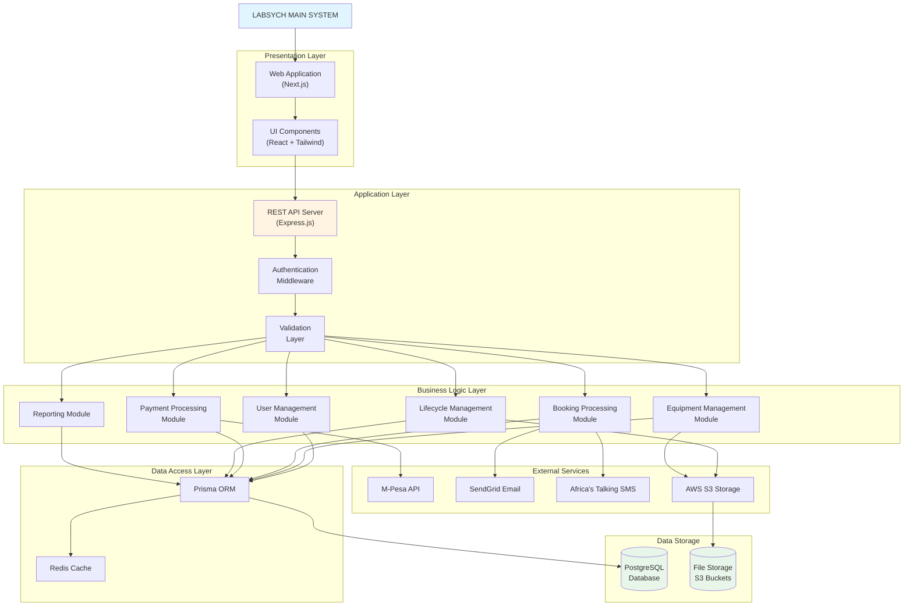
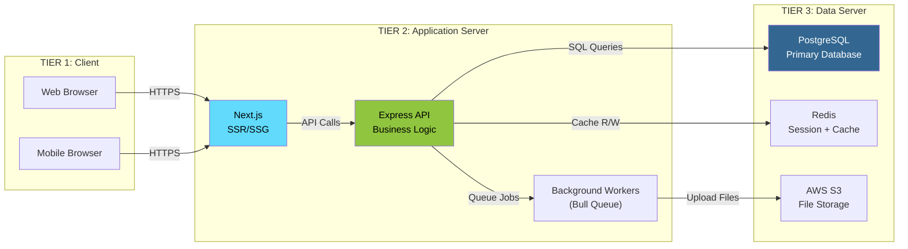
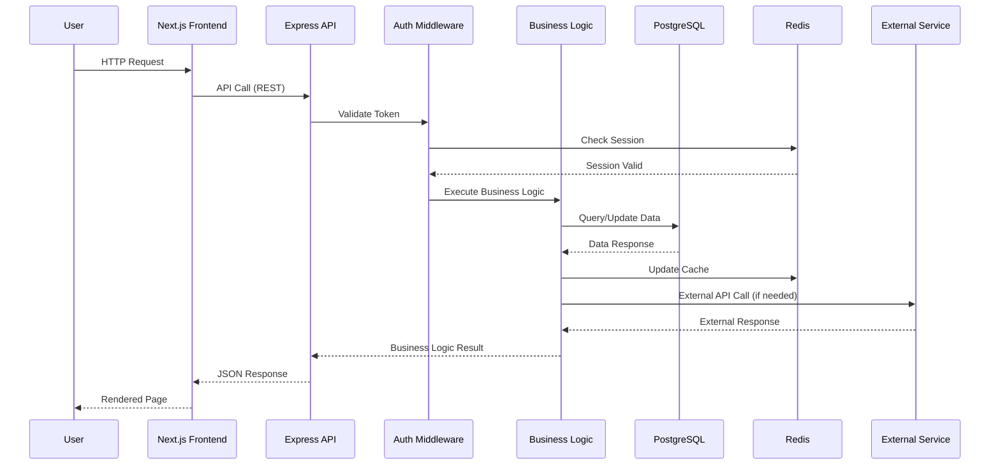
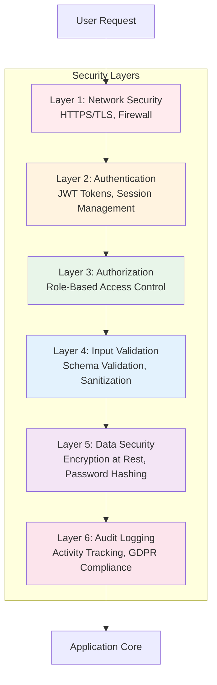
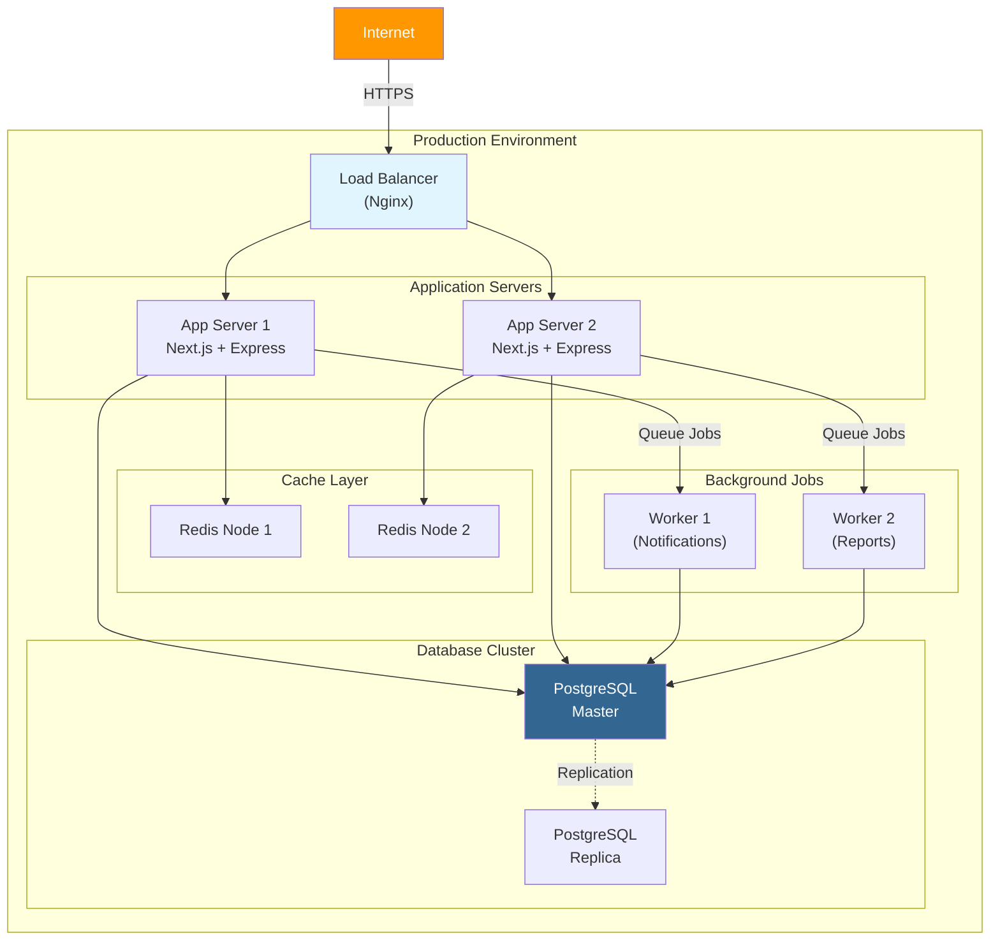
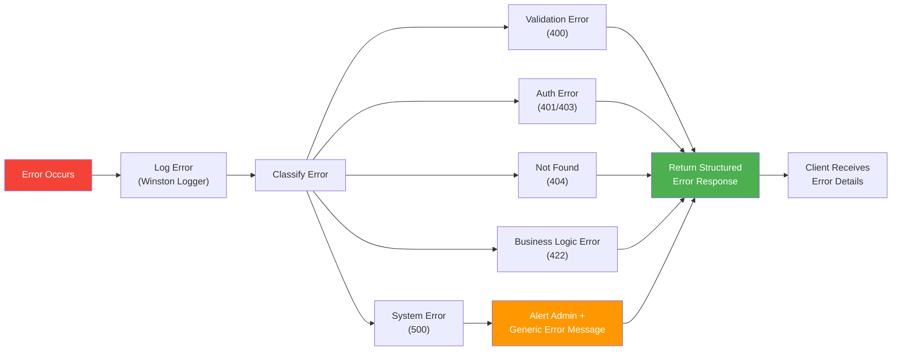

# System Architecture - Program Structure Chart

## High-Level System Structure

---

## Three-Tier Architecture

---

## Module Hierarchy

```mermaid
graph TB
    ROOT["Labsych System"]
    
    ROOT --> FRONTEND["Frontend Module"]
    ROOT --> BACKEND["Backend Module"]
    ROOT --> SERVICES["External Services"]
    
    FRONTEND --> PAGES["Page Components"]
    FRONTEND --> COMPONENTS["Shared Components"]
    FRONTEND --> HOOKS["Custom Hooks"]
    FRONTEND --> UTILS["Utility Functions"]
    
    PAGES --> P1["Landing Page"]
    PAGES --> P2["Authentication Pages"]
    PAGES --> P3["School Dashboard"]
    PAGES --> P4["Admin Dashboard"]
    PAGES --> P5["Equipment Catalog"]
    PAGES --> P6["Booking Pages"]
    PAGES --> P7["Payment Pages"]
    
    BACKEND --> ROUTES["API Routes"]
    BACKEND --> CONTROLLERS["Controllers"]
    BACKEND --> MIDDLEWARES["Middlewares"]
    BACKEND --> MODELS["Data Models"]
    
    ROUTES --> R1["User Routes"]
    ROUTES --> R2["Equipment Routes"]
    ROUTES --> R3["Booking Routes"]
    ROUTES --> R4["Payment Routes"]
    ROUTES --> R5["Admin Routes"]
    
    SERVICES --> EXT1["M-Pesa Integration"]
    SERVICES --> EXT2["Email Service"]
    SERVICES --> EXT3["SMS Service"]
    SERVICES --> EXT4["S3 Storage"]
    
    style ROOT fill:#e1f5ff
    style FRONTEND fill:#fff4e1
    style BACKEND fill:#ffe4e1
    style SERVICES fill:#e8f5e9
```

---

## Component Interaction Flow

---

## Security Architecture

---

## Deployment Architecture

---

## Module Communication Pattern

| Source Module | Target Module | Communication Method | Data Format |
|---------------|---------------|---------------------|-------------|
| Frontend | Backend API | REST API (HTTPS) | JSON |
| API | Database | Prisma ORM | SQL |
| API | Redis | ioredis Client | Key-Value |
| Backend | M-Pesa | HTTPS POST | JSON |
| Backend | SendGrid | HTTPS POST | JSON |
| Backend | S3 | AWS SDK | Binary/Multipart |
| Workers | Database | Prisma ORM | SQL |
| Workers | Email/SMS | HTTPS POST | JSON |

---

## Error Handling Strategy

