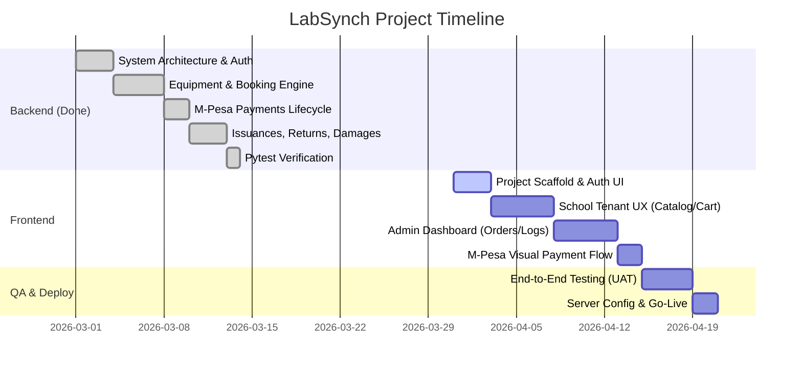

# LabSynch: Work Breakdown Structure & Gantt Chart

## 1. Work Breakdown Structure (WBS)

### Phase 1: Backend API Development (✅ Completed)
- **1.1 Setup & Auth**: Django project, DRF configuration, JWT auth, Role models (`ADMIN`, `SCHOOL`).
- **1.2 Equipment Management**: Models (`Equipment`, `PricingRule`), CRUD services, constraints.
- **1.3 Booking Engine**: Cart creation, complex availability checks, SQL transaction locking.
- **1.4 Payments**: M-Pesa Safaricom STK Push, asynchronous webhook processing.
- **1.5 Inventory Lifecycle**: Issuances, Returns, Damage Reports, and Maintenance pooling.
- **1.6 QA Verification**: Comprehensive Pytest coverage verifying the entire logic scope.

### Phase 2: Frontend Client Development (🚧 Pending)
- **2.1 Initialization**: React layout setup, routing structures, styling foundations.
- **2.2 Auth Integration**: Login pages, JWT lifecycle client configuration, Register form.
- **2.3 School Perspective Interface**: Catalog UI, Cart UI, M-Pesa checkout wizard, personal dashboard.
- **2.4 Admin Perspective Interface**: Datatables for global orders, forms for executing Return handovers, Damage charge assignments, and Maintenance trackers.

### Phase 3: Post-Production & Handoff (⏳ Future)
- **3.1 Global QA / UAT**: Integration tests running both the front and backend cohesively.
- **3.2 Server Provisioning**: Setup cloud database, caching (Redis), web server, static proxies.
- **3.3 Go-Live Deployment**.

---

## 2. Project Gantt Chart

